# NovaOS — Windows-Compatible Operating System
<!-- The regions between "BEGIN generated" and "END generated" markers are built from fragment files by tools/docgen.py: edit those files, not the regions (CONTRIBUTING.md). -->

A clean-room, from-scratch x86-64 operating system that runs native Windows
executables without emulation.  The programs' own machine code runs directly
on the CPU; NovaOS supplies what they expect from Windows: the NT system-call
ABI, the Win32 API, the loader, a GUI, and the drivers underneath.  64-bit
(x64, PE32+) programs run natively, and 32-bit (x86, PE32) ones run through
NovaOS's own WoW64 layer, as on 64-bit Windows.

**Status:** working towards the first release, 0.1 (Phase 22 of the
roadmap).  NovaOS boots on UEFI machines (tested in QEMU with OVMF; no
real PC has been checked yet, see [docs/hardware.md](docs/hardware.md)),
uses every CPU core, keeps its files on a SATA or NVMe disk, and runs
unmodified Windows programs: 7-Zip, Git, Notepad++, Firefox, VLC,
Audacity, KeePassXC, Inkscape, NSIS installers, `.msi` packages (with
their own dialogs, custom actions, shortcuts and services), the Java,
.NET, Node.js and Python runtimes, and OpenGL, Vulkan and Direct3D 8–11
programs through Mesa and DXVK.  It can install itself on a disk from its
live ISO.  New to NovaOS?  Start with the
[user guide](docs/user-guide.md); [docs/compatibility.md](docs/compatibility.md)
lists the programs that run.

- [Screenshots](#screenshots)
- [What runs today](#what-runs-today)
- [What is inside](#what-is-inside)
- [Quick start](#quick-start)
- [Testing](#testing)
- [Roadmap](#roadmap)
- [Repository layout](#repository-layout)
- [Key design decisions](#key-design-decisions)
- [Documentation](#documentation)
- [License](#license)

## Screenshots

Captured from NovaOS running in QEMU at 2560×1600 (200% scale) and stored at
1280×800; [docs/screenshots/README.md](docs/screenshots/README.md) says how
each one was taken.

| | |
|---|---|
|  | 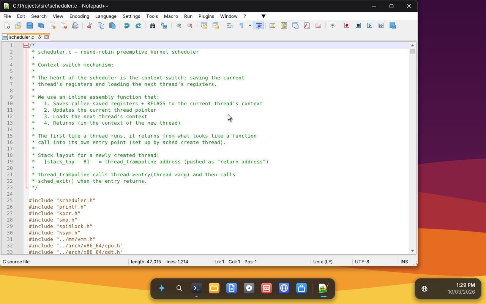 |
| The desktop: Terminal and File Explorer snapped side by side | Notepad++ 8.8 editing NovaOS's own kernel scheduler |
| 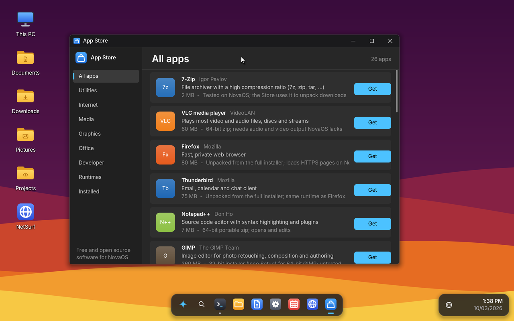 | 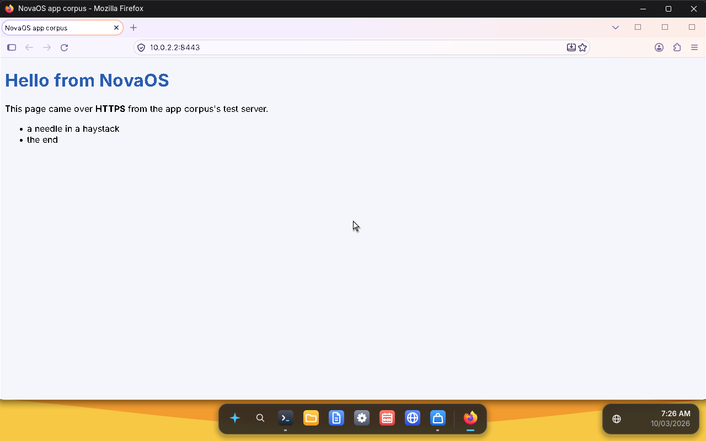 |
| The App Store, which installs real Windows programs | Firefox loading a page over HTTPS |
| 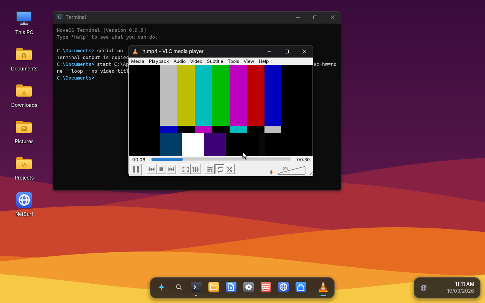 | 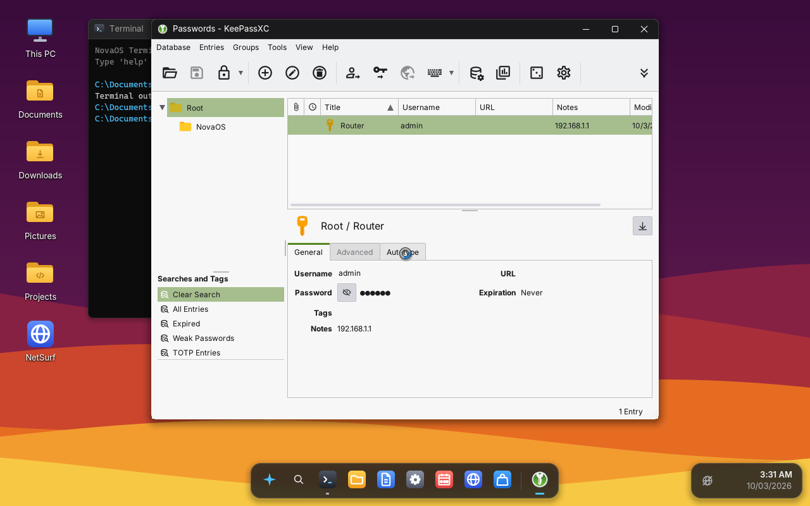 |
| VLC playing an H.264 video with sound | KeePassXC (Qt) with an open password database |
| 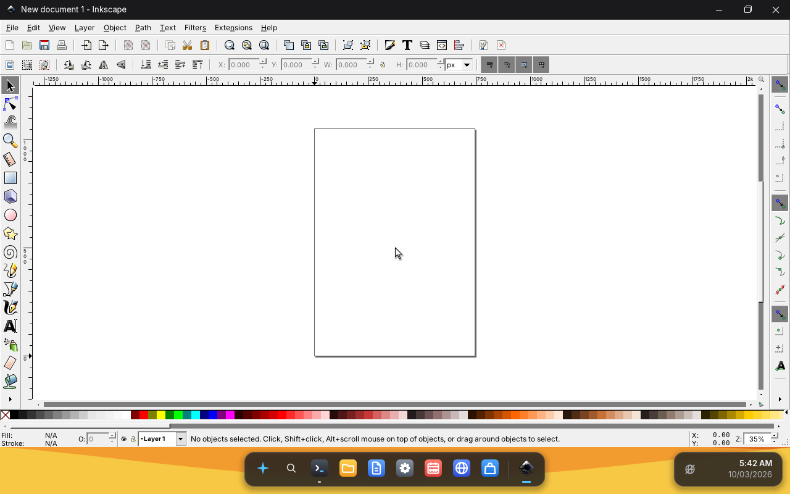 | 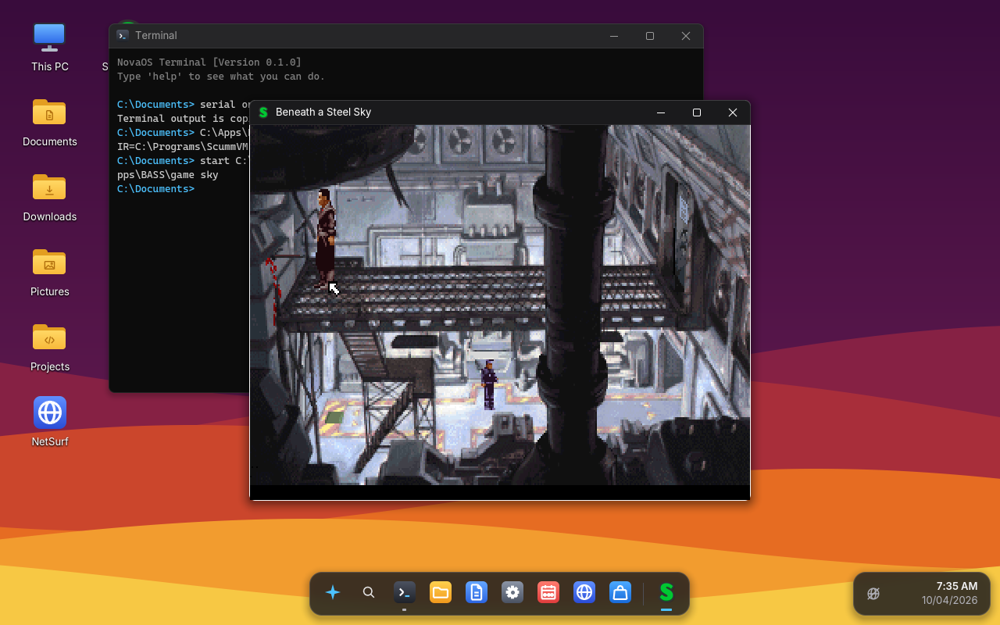 |
| Inkscape (GTK) with a new document | Beneath a Steel Sky (free on GOG) on ScummVM, installed with its installer |
| 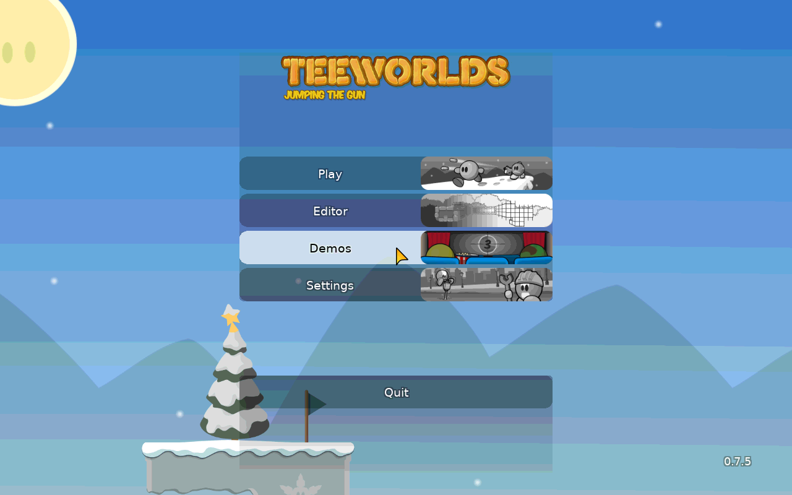 | 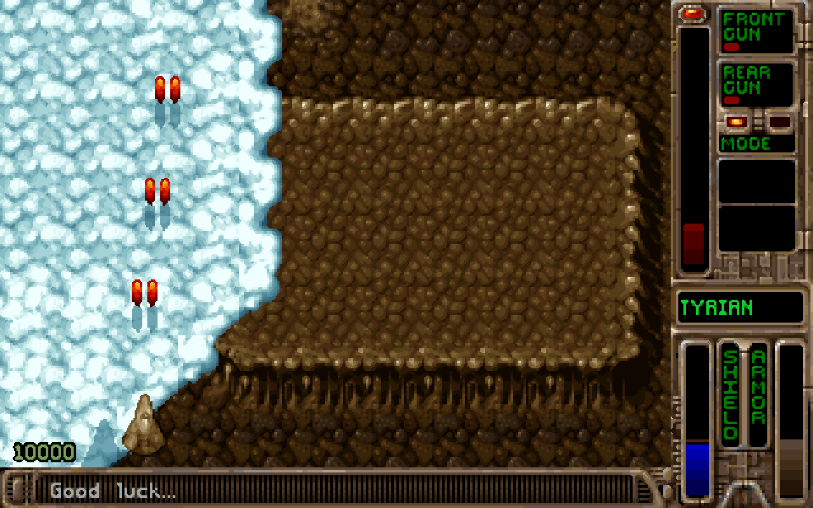 |
| Teeworlds in full screen at its start menu, its music playing | Tyrian 2.1 (freeware) on OpenTyrian in full screen, drawn with Direct3D 9 through DXVK |
| 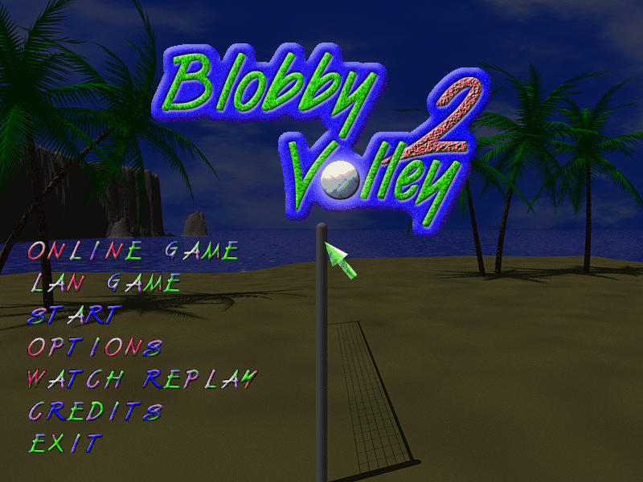 | 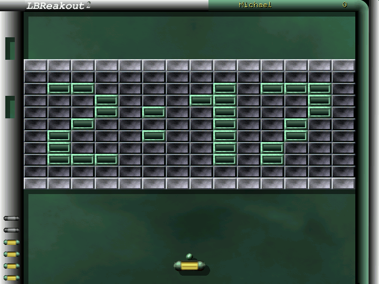 |
| Blobby Volley 2 in full screen: the display switched to 800x600, drawn with Direct3D 9 in exclusive full screen through DXVK | LBreakout2 (SDL 1.2) in full screen: the display switched to 640x480, drawn with GDI |
| 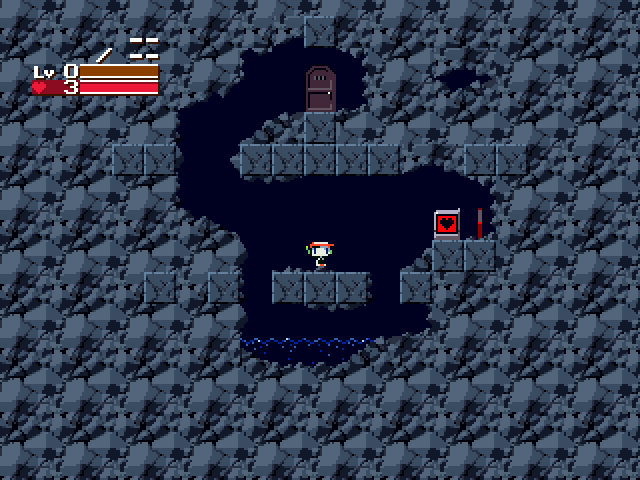 | |
| Cave Story (freeware) in full screen: DirectDraw through cnc-ddraw, the display switched to 640x480 | |

## What runs today

### Unmodified Windows programs

These are official release builds, run as shipped; every fix that made them
work is in NovaOS.  "Tested" is what has been checked in QEMU.

<!-- BEGIN generated:programs -->

| Program | Kind | Tested on NovaOS |
|---|---|---|
| **7-Zip 26.03** (x64) | GUI installer, file manager, `7zG`, `7z.exe` | Installs; the file manager browses, opens archives, adds and extracts with the full dialogs, and drags files out of archives and folders onto other programs; Options has all six pages.  The App Store uses `7z.exe` to unpack downloads. |
| **7-Zip self-extractors** (x86) | 32-bit console and GUI SFX | Unpack an archive. |
| **NSIS installers** (x86, Modern UI) | 32-bit setup programs | Welcome, folder, progress and finish pages; files, registry, desktop and Start menu shortcuts; the uninstaller removes it all. |
| **MinGit 2.47** | Git for Windows (console) | `init`, `add`, `commit`, `log` and `diff` (paged by NovaOS's `less`), `status`, `checkout -b`, `merge`, `gc`, `fsck`, and `clone`/`fetch`/`push` between local repositories. |
| **MSYS2 runtime** (MinGit's `usr\bin`) | `sh.exe` (bash), `ls`, `cat`, `wc`… | Interactive `sh --login -i` sessions in the Terminal (prompt, line editing, colours); `sh -c` with pipes, `$(...)`, subshells, globbing, `fork`, `/dev/null`. |
| **Neovim 0.10 and 0.11** (x64 `.zip`) | Full-screen terminal editor (libuv, LuaJIT) | Opens a file, edits it, `:wq` saves it and exits with code 0; `nvim -l` scripts, `vim.system`, `jobstart` and RPC to an embedded `nvim`. |
| **Eclipse Temurin 21** | Java JRE `.msi`, JDK `.zip` | `java -version`, a threads/exceptions/files stress test, `javac` compiling a program that then runs. |
| **.NET 10** | Runtime and host from NuGet, Roslyn | `dotnet --info`, `dotnet hello.dll`, `dotnet csc.dll` compiling a C# test that passes; globalization through ICU, so German and Japanese numbers, dates, names and sorting come out as on Windows (`tests/dotnet/culturetest.cs`). |
| **Node.js 24** | `.msi`, `.zip` | `node -v`, `-e`, `npm -v`, a crypto/fs/JSON/timers test script; the `.msi` runs its 64-bit and 32-bit custom actions, makes its Start menu shortcuts and uninstalls. |
| **Windows Installer packages** | 7-Zip, CMake, Node.js, Temurin, KeePassXC `.msi` | 7-Zip and CMake install through their own wizards (licence, options, feature tree, progress), CMake's dialogs running its DLL custom actions; custom-action DLLs run in 64-bit and 32-bit custom-action servers; shortcuts and a test service are created and removed again by `msiexec /x`; transforms (`TRANSFORMS=`), whole-file patches (`msiexec /p`, `/uninstall`) and rollback of a failed install; automatic services start at boot; JScript and VBScript custom actions run on `msiscript.dll`. A 32-bit package's system files go to `SysWOW64`, a 64-bit one's to `System32`, whichever process installs it. |
| **Python 3.14** | NuGet package | `-c`, a hashlib/JSON/regex/threads/subprocess test script. |
| **NumPy 2.5.3** | The Windows wheel (`cp314`) in Python 3.14, on NovaOS's own `vcruntime140`, `msvcp140` and UCRT | `import numpy`, complex `exp`/`sqrt`/`log`/`sin`/`tanh`/`power`, `linalg.inv`, `fft`, `eigvals`: the same output as NumPy on Linux. |
| **Mesa 3D 24.2.4** (mesa-dist-win) | `opengl32.dll` (llvmpipe; installed as `opengl32_mesa.dll`, which NovaOS's `opengl32.dll` loads) and the Vulkan driver (lavapipe), x64 and x86, from the App Store | OpenGL 4.5: `tools/gltest` (pixel formats, immediate mode, GLSL, read-back, animated `SwapBuffers`) passes as a 64-bit and a 32-bit program. |
| **DXVK 2.5.3** | `d3d8`, `d3d9` and `d3d11` (as `d3d9_dxvk` and `d3d11_dxvk`, behind NovaOS's own `d3d9` and `d3d11`), `d3d10core`, `dxgi`, x64 and x86, from the App Store, on Mesa's Vulkan and NovaOS's own `vulkan-1.dll` | Direct3D 9 and 11: `tools/d3dtest` (device creation, a D3D9 triangle, D3D11 clear, read-back, animated `Present` in a window) passes as a 64-bit and a 32-bit program, `d3dtest angle` brings Direct3D 11 up the way ANGLE (Chromium's GPU process) does, and `d3d9test` checks NovaOS's `d3d9.dll` with and without DXVK. |
| **Venus** (Mesa 26.2.4, built by `tools/build_venus.py`) | `vulkan_virtio.dll` and Mesa's virgl (`opengl32_virgl.dll`, `libgallium_virgl.dll`), x64 and x86, from the App Store: Vulkan and OpenGL on the host's GPU through a QEMU 3D virtio-gpu (`virtio-vga-gl,venus=on`); the Vulkan loader prefers Venus to lavapipe and NovaOS's `opengl32.dll` virgl to llvmpipe | `tools/d3dtest` (DXVK) and `tools/gltest` pass on it as 64-bit and 32-bit programs, and `d3dtest fps` and `gltest fps` draw faster on it than on lavapipe and llvmpipe. |
| **Notepad++ 8.8.3** (x64 portable) | Scintilla editor, static MSVC C++ runtime | Opens with its menus, toolbar, tab bar, editor and status bar, takes typing, and opens and saves files through the common file dialogs. |
| **SumatraPDF 3.4.6** (x86 portable) | PDF reader on MuPDF; GDI+ toolbar, tabs and caption | Opens a PDF and renders its pages; the toolbar, tabs and menus draw; printing reports no printer. |
| **WinMerge 2.16.50** (x64) | MFC application: MDI frame, docking bars, rebars, toolbars with 24-bit image strips | Compares two files side by side with the differences highlighted, location pane and status bars. |
| **PuTTY 0.81** (x64, built from source with MinGW) | Terminal emulator on `WSAAsyncSelect` networking | A raw connection to a host: the server's greeting shows, typed lines go out and the echo comes back. |
| **ripgrep, fd, bat, jq, fzf** | Rust (MSVC), C (MinGW), Go | Searching, walking folders, printing files, filtering, from the Terminal. |
| **Floorp 12.19** (Firefox 157 engine, x64) | Gecko browser | Starts, creates its profile, and draws the full browser window (toolbar, address bar, sidebar) with DirectWrite text through its GPU process, and takes keyboard input.  Its sandboxed child processes (tab, extension, GPU, network, media) start and talk to the main process.  It fetches and shows pages over HTTP and HTTPS, scrolls and takes typing in forms.  See [Firefox](docs/HISTORY.md#firefox-floorp). |
| **Firefox 157.0** | Mozilla's full installer (x64), from the App Store | The App Store's Install button unpacks it with 7-Zip into `C:\Programs\Mozilla Firefox`; Firefox starts unmodified (its launcher process sets up the browser process with its DLL blocklist hooks), draws its whole window through its GPU process, and loads and shows a page over HTTPS (a test CA trusted through `distribution\policies.json`); in the nightly corpus.  Window titles show their dashes as `-`. |
| **KeePassXC 2.7.12** | Portable zip (Qt 5, x64) | Opens and unlocks a KDBX 4 password database (Argon2d) and shows its groups, entries and an entry's details, Qt's widget text drawn through `GetGlyphOutline`; in the nightly corpus.  Windows Hello quick unlock reports "not supported". |
| **Inkscape 0.91** | conda-forge's win-64 package (GTK 2, MinGW, x64) | Starts with a new document: menus, tool bars, toolbox, rulers, canvas, palette and status bar, drawn by GTK 2 through cairo and pango on gdi32, with its tools' own pointers; in the nightly corpus.  Inkscape 1.x (GTK 3) is not tested yet: its downloads are not reachable from CI. |
| **Krita 5.3.4** | Portable zip (Qt 5, LLVM MinGW build, x64) | Starts, opens a new image with Ctrl+N on its OpenGL canvas (the App Store's Mesa 3D) with the toolbox, colour selector, layers and brush presets and paints a stroke, its C++ exceptions unwinding through libunwind on NovaOS's SEH; in the nightly corpus.  Needs Mesa 3D installed first.  Its Python scripter imports `asyncio`. |
| **VLC 3.0.21** (x86, the PortableApps package) | Qt 5 media player | Plays an H.264 and AAC MP4 with its Qt interface, the video in its window (GDI output) and the sound through WASAPI; part of the nightly app corpus. |
| **Audacity 3.7.4** (x64 zip) | wxWidgets audio editor | Records from the microphone (WASAPI capture), draws the waveform, stops and saves the project as an `.aup3` (SQLite) through its save dialog; part of the nightly app corpus. |

<!-- END generated:programs -->

### Built in

- **Desktop**: a Windows 11-style shell with a Start menu (live search over
  apps, settings and files), dock, tray, snapping and resizing windows,
  Alt+Tab, right-click menus, three wallpapers.
- **Apps**: Terminal, File Explorer, Notepad, Settings (its Sound page
  chooses the output and input and sets each device's volume, kept across
  restarts), Calendar, Photos, the **App Store**, **Install NovaOS**
  (Setup) and **Welcome to NovaOS**, the first-boot setup of an installed
  system (your name, time zone, keyboard layout and the display resolution).
- **Web browser**: NetSurf 3.11, built from source as a Windows program,
  with HTTPS (TLS 1.3/1.2), JavaScript (pages a script changes are laid
  out again) and SVG (image files and `<svg>` written inline in a page),
  in a window you can resize, maximize or snap (the page is laid out
  again to fit).
- **Command line**: the Terminal (command lines of up to 8,191
  characters, wrapped at the window's width; programs get up to 32,766
  through `CreateProcess`, as on Windows), its own commands (`dir`, `copy`, `ping`,
  `curl`, `wget`, `certutil`, `tasklist`, `trace NAME`, `vol`, `sync`,
  `devices`, `crashes`…)
  and NovaOS's `cmd.exe` with batch files, plus `find`, `findstr`, `sort`,
  `more`, `less` (git's pager), `timeout`, `taskkill`, `whoami`, `tzutil`, `reg`, `regsvr32`, `msiexec` and
  `intl` (the user's regional format).

### The App Store

The dock's App Store downloads the official 64-bit packages of 21 open-source
programs (Firefox, VLC, LibreOffice, GIMP, Notepad++, PuTTY…) and six
runtimes, and installs them with 7-Zip, NovaOS's Windows Installer or the
program's own setup.  `store install NAME` in the Terminal does what the
row's button does (CI installs Mesa 3D, DXVK and Venus that way), and `store open` opens it.  Its list scrolls with the same scroll bar as File Explorer's.  Most of those programs still need more of Windows than
NovaOS has (more of the GUI); the ones in the table
above are the ones verified.  See [the App Store](docs/HISTORY.md#the-app-store).

## What is inside

A one-paragraph tour; [docs/HISTORY.md](docs/HISTORY.md) has the details of
every part, phase by phase.

<!-- BEGIN generated:inside -->

- **Boot**: a UEFI bootloader (a PE32+ EFI application) loads the ELF kernel
  from the EFI System Partition, or from the ISO on a CD or written to a
  USB stick (the installation media, run live; started from a stick,
  NovaOS writes its log into `\EFI\NOVA\bootlog.txt` on it).
- **Kernel** (`kernel/`): NT-style executive: object manager and handles,
  processes and threads, virtual memory with sections and guard pages
(the read-only pages of loaded DLLs are shared by every process with the
same bytes, as Windows shares image sections), I/O,
  registry, security tokens (restricted tokens, impersonation) and
  security descriptors checked when named objects and files on drive C:
  are opened.  SMP with per-core scheduling and fine-grained
  locks; wait queues; APCs; pipes; the NT system-call table at Windows 10
  1903 numbers.  Timers are the local APIC's, one-shot or TSC-deadline and
  calibrated against the HPET (from CPUID leaf 0x15 where the firmware
  hides it), so `Sleep(1)`, wait timeouts and waitable
  timers end within a fraction of a millisecond even with every CPU busy;
  a thread woken by a timer preempts the running one instead of waiting
  for its time slice to end.  NT's priority boosts: a thread woken by an
  event, a lock, I/O, a window message or input runs above its base
  priority (+1 to +6; +2 for window messages and the input they carry,
  as win32k gives) and preempts busy threads of that priority, then
  decays back one level per quantum; a balance set lifts threads that
  have starved for 3 s.  Priority classes and thread priorities
  (`SetPriorityClass`, `SetThreadPriority`) set NT's base priorities;
  every kernel thread (input, audio, the network, USB, the desktop,
  saving drive C:) stays above anything a program can ask for, and the
  process whose window is active (or the console program running in the
  active Terminal) gets NT's foreground boost (+2 after every wait) and
  three times the time slice (60 ms against 20 ms).  The Multimedia
  Class Scheduler (`AvSetMmThreadCharacteristics`) runs a program's audio
  threads at real-time priority 18, above every program thread and the
  desktop, with Windows' 80% budget so one cannot freeze the machine;
  NovaOS's own sound threads (waveOut, waveIn, DirectSound, WASAPI) use
  it too.
- **Drivers**: AHCI SATA and NVMe disks (NovaOS installs to and boots from
  either), FAT16/FAT32, GPT, NTFS (read, write and format: drive C: with
  file ACLs and hard links, and other drives); Intel e1000/e1000e network cards (82540EM, 82574L
  and the I219 that Intel PCs have built in) and virtio-net; Intel High Definition Audio (playback
  and recording, laptop controllers with the audio DSP on included, the
  speakers turned off while headphones are plugged in; a laptop's digital
  microphones through Sound Open Firmware on Intel's audio DSP) with a kernel mixer;
  PS/2 keyboards and mice; I2C-HID touchpads on Intel's LPSS I2C
  controllers (found through ACPI; tap to click, two-finger tap for the
  right button and two-finger scrolling as mouse-wheel input; read when
  their interrupt pin on Intel's GPIO controller fires); USB (xHCI, EHCI, OHCI and UHCI controllers, any
  number of each) with hubs and HID keyboards (lock-key LEDs and media
  keys included), mice (five buttons and both wheels), tablets, pens
  (pressure, X/Y tilt, barrel rotation, barrel buttons and eraser, for
  Wintab and as `WM_POINTER` pen messages) and
  multi-touch screens (report protocol), USB sticks (FAT and NTFS, as
  the next drive letter, hot-plugged) and USB speakers, headsets and
  microphones (USB Audio Class 1 and 2 over isochronous transfers, at the
  device's own sampling rate and channel count, which the mixer runs at,
  asynchronous devices' rate feedback followed, played on and recorded
  from as soon as they are plugged in, or chosen in Settings' Sound page,
  each with its own volume; the choice and the levels are kept across
  restarts), and game controllers (wired Xbox 360 and Xbox One
  controllers, with their motors, and HID game pads, for XInput,
  DirectInput 8, Raw Input and `hid.dll`); virtio multi-touch screens,
  pens (pressure, tilt, rotation) and tablets; CMOS clock; a VBE display
  driver for QEMU's standard VGA, QXL, virtio-vga and VMware adapters,
  bochs-display and VirtualBox (resolutions switched at run time, page
  flipping, the mode set again after sleep and kept across restarts; more
  adapters, such as QEMU's secondary-vga, are more monitors of one
  desktop, arranged in Settings, each able to show DPI-aware programs
  its own DPI) and a Cirrus GD5446 one, with
  the UEFI framebuffer as the fallback; a virtio GPU driver for
  QEMU's virtio-vga and virtio-gpu-pci, whose outputs are several
  monitors on one card, plugged in and unplugged while NovaOS runs, and
  which on a 3D one (`virtio-vga-gl`) gives Mesa's Venus and virgl (App
  Store) their contexts, host-visible blobs, 3D resources, transfers and
  fences, so Vulkan, DXVK and OpenGL run on the host's GPU; ACPI power-off, reset, power buttons,
  sleep (S3, or low-power S0 idle on firmware without it), batteries and
  AC adapters, the lid, thermal zones, wake devices and PCI interrupt
  routing (AML interpreted by uACPI, with the SCI a real interrupt
  through the I/O APIC), and the embedded controller laptops keep their
  lid and battery behind.
- **Networking**: lwIP (TCP/IP over IPv4 and IPv6: DHCP, SLAAC, DNS over
  either), an HTTP/1.1 client, and Mbed TLS with the Mozilla root store.
  The loopback interface carries 127.0.0.1 and ::1 (and traffic to the
  machine's own addresses), and `localhost` resolves to both without DNS.
  Winsock (`ws2_32`, and `wsock32` with Winsock 1.1's ordinals) speaks IPv6
  and dual-stack sockets with `getaddrinfo`, and its socket options reach
  the TCP/IP stack (`TCP_NODELAY`, `SO_RCVTIMEO`/`SO_SNDTIMEO`,
  `SO_LINGER`, `SO_REUSEADDR`, `SO_KEEPALIVE`, `SO_BROADCAST`, `IP_TTL`,
  `SO_RCVBUF`/`SO_SNDBUF`) and read back; a program keeps hundreds of
  sockets open at once, as a browser does, and `select`, `WSAPoll` and
  `WSAEventSelect` wait on any number of them; a UDP socket can be
  connected to a peer, and `WSADuplicateSocket` hands a socket to another
  process (Chromium's DNS client and its network process use both);
  overlapped requests that have to wait (an `AcceptEx`, a `ConnectEx`, a
  `WSARecv` with nothing to read yet) stay pending and complete on an I/O
  completion port, which proactor event loops such as Python's asyncio need;
  `winhttp` is a real HTTP client over Schannel TLS, with HTTP/2 by ALPN
  (nghttp2).
- **Windows userland** (`userland/`): about 35 system DLLs written from
  scratch and compiled with clang for `x86_64-pc-windows-msvc`, and again
  for `i686` in `SysWOW64`: `ntdll`, `kernel32`, `msvcrt`/`ucrtbase` with
  the `api-ms-win-crt-*` API sets (`errno` and the rest of the C
  runtime's per-thread state kept per thread, as on Windows, with
  `_configthreadlocale` per-thread locales and `getenv` results other
  threads cannot overwrite; `ntdll` gives fiber-local storage its own
  slots and runs `FlsAlloc` callbacks when a thread or the process ends;
  `TlsAlloc` has the 1024 expansion slots past the TEB's 64), `vcruntime140`/`vcruntime140_1` (C++
  exceptions, FH3 and FH4 tables), `msvcp140` and its satellites (the C++
  standard library: Microsoft's own STL, compiled with clang, with
  Boost.Math under `msvcp140_2`'s special math functions),
  `user32`/`gdi32` (a real window system, controls, menus, dialogs, MDI,
  hooks, per-monitor and per-thread DPI awareness with `WM_DPICHANGED`, controls and fonts at each window's DPI and rescaled when it changes, window coordinates converted between awareness contexts,
  touch, pens and the mouse as `WM_POINTER` messages with `GetPointerPenInfo`, title bars included, and the pen signature in `GetMessageExtraInfo`; `SetCursorPos` and `ClipCursor` for the window in front, as games recentre and confine the pointer), `gdiplus` (GDI+ on the MIT-licensed plutovg rasteriser),
  `comdlg32` (the Open and Save As dialogs, classic and `IFileDialog`),
  `comctl32`, `riched20`/`msftedit` (Rich Edit controls that take RTF,
  as setup programs' licence pages need), `shell32`, `ole32`/`oleaut32` (COM and OLE Automation with
  type libraries, and calls between processes over named pipes with the standard marshaler and the `IDispatch` proxy; the Windows Runtime's strings and the few runtime classes Win32 programs ask for, such as `UISettings` for the user's colours), `rpcrt4` (the NDR engine COM proxy/stub DLLs run on:
  stubless proxies, `NdrStubCall2`, `CStdStubBuffer`, the `NdrDll*` entry points), `advapi32`, `ws2_32`, `oleacc`,
  `winmm` and `mmdevapi` (sound: `waveOut`, `waveIn`, `PlaySound`, MIDI,
  WASAPI playback and capture, a device ID or endpoint for each sound
  device, device 0 being the default as on Windows, each with its own
  endpoint volume; sound plays at its own rate and is converted once, by
  the mixer, to the device's), `dsound` (DirectSound, with
  every device enumerated and openable by its GUID),
  `xaudio2_7`/`xaudio2_8`/`xaudio2_9` and `x3daudio1_7` (on FAudio; every
  output listed and openable by its device ID), `msi`
  (with `msiscript` running JScript and VBScript custom actions on the
  ISC-licensed mujs; product, patch and source-list queries by
  installation context, as bootstrappers such as WiX Burn make them), `msxml6` (MSXML: the XML DOM with XPath, SAX and
  `XMLHTTP` on the MIT-licensed libxml2, answering the MSXML 3 classes
  such as `Msxml2.DOMDocument` too),
  `secur32` with Schannel (TLS 1.3/1.2 for programs, on Mbed TLS),
  `crypt32` and `wintrust` (certificate stores and chains, signed PKCS #7
  messages, and Authenticode: `WinVerifyTrust` checks a program's
  signature, its timestamp and its chain to the trusted roots, and the
  Microsoft root policy tells Microsoft's own signatures apart),
  `usp10` (Uniscribe), `normaliz` (IDN), `urlmon` (`CreateUri`, and the
  Internet security manager's zones),
  `wintab32` (Wintab pen tablets: pressure, tilt and barrel rotation for GTK,
  Qt and Krita), `cabinet` (the FDI functions installers extract cabinets
  with, MSZIP and LZX, on `msi`'s cabinet readers), `wldap32` (LDAP
  sessions, for programs that link to it; no directory servers yet),
  `opengl32` (Mesa from the App Store, or with no driver NovaOS's own
  OpenGL 1.1, which draws 2D as ScummVM needs: textures, vertex arrays,
  blending, scissor), and
  the DLLs Firefox delay-loads (`d3d11`, `credui`, `winspool.drv`,
  `dhcpcsvc`, `d3dcompiler_47`), the ones Qt WebEngine imports
  (`bthprops.cpl`, `d3d12`, `winusb`: no Bluetooth radio, Direct3D 12
  device or WinUSB device, as on a PC without them, with Bluetooth's SDP
  record parsers working in full), and more.
- **Text**: `novatext.dll`, the text core built once and shared, carries
  HarfBuzz (shaping) and FreeType (fonts).  Uniscribe (`usp10`) itemizes
  text by script and direction and shapes it with HarfBuzz, and GDI's
  `ExtTextOut` sends complex scripts through it, as Windows' LPK does, so
  Arabic, Hebrew and the Indic scripts join, reorder and run right to left.
  Arabic and Devanagari draw with Noto Sans; GDI falls back to them by
  script.  DirectWrite (`dwrite`) lays text out on the same core, with
  font fallback: `tools/dwtest` draws Latin, Arabic and Devanagari in one
  line from a Latin-only font.  Its factory is an `IDWriteFactory3`, with
  Windows 10's font sets, font face references and `IDWriteFontFallback`,
  which Chromium's browsers (Steam's, WebView2) ask for
  (`tools/dw3test`).
- **2D drawing**: Direct2D (`d2d1.dll`) draws in software: geometries
  (rectangles, ellipses, paths with Béziers and arcs, groups, transforms,
  combining, widening, tessellation), strokes with caps, joins and dashes,
  solid, gradient and bitmap brushes, layers and clips, on HWND, DC and
  bitmap render targets.  Text goes through DirectWrite's text formats and
  layouts.
- **Media tools**: a current Windows build of ffmpeg runs unchanged and
  converts H.264 and AAC to VP9 and Opus with all its threads.
- **Media players and editors**: VLC plays video with sound and Audacity
  records and saves, on the same WASAPI, GDI and message-loop code paths
  real Windows programs take (Qt's `WH_GETMESSAGE` hook, wxWidgets'
  buffered painting).
- **ICU** as Windows 10 ships it: `icu.dll` (ICU 77.1, x64 and x86,
  built by `tools/build_icu.py`) with its data in
  `C:\Windows\Globalization\ICU`.  .NET does its globalization through
  it, and kernel32 answers `GetLocaleInfoEx` from it for every one of the
  864 Windows locales and formats dates, times, numbers and money in them
  (`GetDateFormat`, `GetTimeFormat`, `GetNumberFormat`,
  `GetCurrencyFormat`, `GetDurationFormat`) in their calendars (Japanese
  eras, Thai Buddhist, Hebrew, Hijri, Um Al Qura, Persian...).  The user's
  regional format is set with `intl NAME` or Settings > Time & language and
  kept in the registry, with the user's own changes to it
  (`SetLocaleInfo`).
- **Program support**: the PE loader with TLS, `DllMain`, forwarders and
  API sets; x64 and x86 structured exceptions, with Windows'
  alignment-fault fixup for misaligned SSE moves; Windows' segment
  selectors, so 64-bit programs can far-jump into 32-bit code; registry saved to disk;
  COM in-process and local (`LocalServer32`) servers, type libraries,
  proxy/stub DLLs and calls between processes; drag and drop; a shared clipboard; `.lnk`
  shortcuts; Windows Installer packages; services (`advapi32`'s service
  control manager); event tracing as Windows answers with no logging
  session running (providers register, controllers and consumers find no
  session); scheduled tasks (Task Scheduler 2.0, kept in
  `C:\Windows\System32\Tasks`); the Data Protection API.
- **Updates**: the App Store's Updates page downloads a newer NovaOS from
  an update channel signed with the release key (Ed25519), and the next
  restart starts it, going back to the old one if it does not start
  ([docs/updates.md](docs/updates.md)).
  Every green build of `main` is also an update, on its own channel.

<!-- END generated:inside -->

## Quick start

Linux (Ubuntu/Debian) is the build host; on Windows use WSL2.

Install the prerequisites, build the bootloader, the kernel with the whole
userland inside, and `nova.img`, then run it in QEMU:

```bash
sudo apt install cmake nasm clang lld llvm libc++-dev gcc-mingw-w64-x86-64 \
                 python3 qemu-system-x86 ovmf mtools dosfstools xorriso
mkdir build && cd build
cmake ..
make -j$(nproc)
cmake --build . --target run
```

The first build compiles the NetSurf browser (about 800 files; later builds
reuse the objects).  Set `NOVA_NO_NETSURF=1` to leave the browser out, and
`NOVA_NO_WOW64=1` to skip the 32-bit userland.  `run` attaches a second
disk, `build/nova-data.img`, where drive C: is kept across restarts and
rebuilds.  [docs/building.md](docs/building.md) covers the build, QEMU
options, putting your own programs on the disk, and debugging.

### Bootable ISO and installing on a disk

A ready-to-boot UEFI ISO, `nova.iso`, is built by CI rather than committed.
Download it from the [newest release](https://github.com/dean-plude/os/releases/latest)
with its checksum (`sha256sum -c nova.iso.sha256`), take the one built
from `main` from the [`latest` build](https://github.com/dean-plude/os/releases/download/latest/nova.iso),
or the `nova-iso` artifact of any pull request's CI run (the
**Artifacts** list on the run's Summary page).  It is also the installation disc: booted from it, NovaOS runs live and
opens **Install NovaOS**, which writes a GPT disk with an EFI System
Partition and a data partition for drive C:.

```bash
truncate -s 1G disk.img
cp /usr/share/OVMF/OVMF_VARS_4M.fd /tmp/OVMF_VARS.fd
qemu-system-x86_64 -machine q35 -m 2G -smp 4 \
  -drive if=pflash,format=raw,unit=0,readonly=on,file=/usr/share/OVMF/OVMF_CODE_4M.fd \
  -drive if=pflash,format=raw,unit=1,file=/tmp/OVMF_VARS.fd \
  -drive file=disk.img,format=raw -cdrom nova.iso
```

After installing, the same command without `-cdrom nova.iso` starts from
`disk.img`.  The first start from it opens **Welcome to NovaOS**, which
asks for your name, your time zone, your keyboard layout and a display
resolution before the desktop (`start welcome` in the Terminal goes through it again).

Give the machine 2 GB so downloaded installers fit in drive C: (which lives
in memory and is saved to disk).  On macOS with Homebrew QEMU, the firmware
ships with QEMU:

```bash
FW="$(brew --prefix qemu)/share/qemu/edk2-x86_64-code.fd"
qemu-system-x86_64 -machine q35 -m 2G -smp 4 \
  -drive if=pflash,format=raw,readonly=on,file="$FW" \
  -cdrom nova.iso -serial stdio
```

The same ISO starts a real PC from a USB stick (UEFI, Secure Boot off;
the display is the firmware's framebuffer).  Writing it erases the stick:
on Linux, find the stick with `lsblk` (here `/dev/sdX`) and run the
commands below; on Windows use Rufus in "DD image" mode or balenaEtcher,
and on a Mac see [docs/macos.md](docs/macos.md).  Started from the stick,
NovaOS runs live as from the disc and writes its log into
`EFI\NOVA\bootlog.txt` on the stick's EFI partition (partition 2,
labelled `NOVA_EFI`), so a PC without a serial port still leaves a log to
read on another computer.  Linux mounts that partition as it is; macOS
with `diskutil mount` (`disk4s2` for a stick at `disk4`); Windows gives
an EFI partition no drive letter by itself, so assign one in `diskpart`
(`list volume`, `select volume N`, `assign letter=Z`).

```bash
sudo dd if=nova.iso of=/dev/sdX bs=4M conv=fsync status=progress
sync
```

To make the ISO yourself from a fresh build, run
`scripts/create-iso.sh nova.iso build/bootx64.efi build/kernel.elf`
(needs `xorriso`).  `*.iso` is in `.gitignore`: the ISO is never committed.

## Testing

**Every pull request is boot-tested.**  GitHub Actions
(`.github/workflows/ci.yml`) builds the kernel, bootloader, userland and
`build/nova.img`, boots it in QEMU with OVMF and runs three suites with
`tools/selftest.py`:

- **Build and boot-test** (core): <!-- BEGIN generated:core-tests -->`apitest`, `abitest` (the PEB, TEB, `KUSER_SHARED_DATA`, `CONTEXT` and
  loader layouts, ntdll's stubs and the system-call numbers, against
  Windows 10 1903 x64), `syscalltest` (the system-call table reached
  without ntdll: ntdll's Zw exports ranked by address give each service
  its Windows 10 1903 number, and the kernel answers that number, as
  anti-cheat code expects), `aligntest` (a misaligned SSE access is
  fixed up to the unaligned move when alignment-fault fixup is on, as
  anti-cheat code expects; ThreadHideFromDebugger and the
  extended-context functions), `gatetest` (Windows' segment selectors,
  32-bit code in a 64-bit program through a far jump to 0x23,
  GetThreadContext on the calling thread and `__fastfail`, as anti-cheat
  code expects), `filetest`, `linktest`, `pipetest`, `proctest`,
  `dlltest` (DllMain, static TLS, and a DllMain returning FALSE stopping
  the program with 0xC0000142, 64- and 32-bit), `sectest`, `acltest`
  (64- and 32-bit), `guitest auto`, `inputtest` (side buttons,
  horizontal wheel, volume keys), `usbcheck` (media keys, AC Pan, pen
  pressure, tilt and twist, virtio pens and tablets), `anitest`
  (animated cursors and program pointers), `cursortest` (system
  pointers, SetSystemCursor, cursors at the display scale), `bmpcurtest`
  (1-, 4-, 8- and 16-bit DIB sections, cursors from bitmaps with alpha
  or monochrome masks), `pentest` (a pen as WM_POINTER* messages: enter,
  down, update, up, leave; GetPointerPenInfo pressure, tilt, rotation,
  barrel and eraser; DefWindowProc promotion to mouse with the pen
  signature in GetMessageExtraInfo; WM_NCPOINTER* over a title bar and
  WM_POINTERACTIVATE; the mouse as a pointer, entering and leaving
  windows; 64- and 32-bit), `wintabtest` (wintab32 with no pen and with
  a synthetic one: contexts, packets, pressure, tilt and rotation),
  `dpitest` (per-monitor DPI: the manifest's `dpiAwareness`,
  `GetDpiForMonitor`, `GetDpiForWindow`, `WM_DPICHANGED` and its
  suggested rectangle when the monitor goes to 192 DPI and back, and the
  window and monitor coordinates an aware, an unaware and a system-aware
  process see; user32's controls, menus, scroll bars, dialogs, metrics
  and fonts at 192 DPI; per-thread awareness contexts; controls and
  dialogs rescaled when a window's DPI changes, comctl32 at 192 DPI, and
  coordinates converted between awareness contexts), `disptest`,
  `icutest` (ICU and locales, 64- and 32-bit), `comtest`, `nlstest`
  (date, time, number and currency formats in German and Japanese, 64-
  and 32-bit; `nlstest user`), `nlstest calendars` (Japanese eras,
  Buddhist, Taiwan, Tangun, Hebrew, Hijri, Um Al Qura and Persian dates;
  `GetDurationFormat`) and `nlstest override` (`SetLocaleInfo`), 64- and
  32-bit, `tlbtest` (type libraries, 64- and 32-bit), `usptest` (Arabic
  and Devanagari shaped through Uniscribe and drawn by `ExtTextOut`, 64-
  and 32-bit), `cppeh`, `dlgtest` (the common file dialogs:
  `OPENFILENAME` settings, `IFileDialog` objects), `unwindtest`,
  `stltest` (the C++ standard library, 64- and 32-bit), `delaytest` (the
  DLLs Firefox delay-loads), `rttest` (complex math, conio, DLL
  directories, 64- and 32-bit), `qttest` (what Qt programs need:
  `GetGlyphOutline`, C++/WinRT `HSTRING`s, Windows Hello, the process
  DACL), `battery` (against the battery in `tests/acpi/battery.asl`),
  `soundtest` (the recorded WAV must hold the tones played), `soundtest
  record`, `capture` and `volume` (`waveIn` and WASAPI capture must
  record the tone the microphone hears, and a quarter of the endpoint
  volume must sound 12 dB quieter), `soundtest dsound` and `dscapture`
  (DirectSound playback with notifications, frequency and volume, and
  DirectSoundCapture recording the microphone), `sleeptest timer`
  (`Sleep(1)`, 1 ms wait timeouts and waitable timers (periodic ones,
  their completion routines and timer queue timers too) end within a
  millisecond with every CPU busy), `soundtest mme` (`waveIn` recorded
  as PortAudio's MME host does, the program held up 250 ms a second: no
  input overflow, and no frame missing from the recorded tone),
  `savetest` (while NovaOS saves 32 MiB of drive C: to its disk, calls
  behind the kernel, desktop and file-system locks keep answering, the
  file-system one within 100 ms; the save holds the file-system lock
  under 20 ms), `xa2test` (XAudio2 2.9 and 2.7 voices, callbacks and
  effects, and X3DAudio panning), `powertest` (closing the lid in
  `tests/acpi/lid-thermal.asl` sleeps, a USB key and the lid wake it,
  the thermal zone's readings), `disptest 1024 768` (saves the mode the
  restart must keep), `miditest` (MIDI through `midiOut`, `midiStream`
  and the MCI sequencer), `nlstest set ja-JP` (the user locale the
  restart must keep), an installer that replaces a running program and
  finishes after a restart (`filetest install`, `shutdown /r`, `filetest
  installed`), `nlstest after-restart ja-JP` (the restart kept the user
  locale), `disptest saved 1024 768` (the restart kept the saved display
  mode), hard links kept across a restart (`linktest restarted`),
  Windows Installer transforms, patches and rollback, and an installed
  service started at the next boot (`msitest transform`, `patch`,
  `rollback`, `service`, `shutdown /r`, `msitest service-boot`), Windows
  Installer JScript and VBScript custom actions setting and reading
  properties and writing files, and a failing script rolling its install
  back (`msitest script`), `smftest` (the C++17 special math functions
  in `msvcp140_2.dll`, 64- and 32-bit), `errnotest` (errno and the other
  C runtime per-thread state belong to each thread, 64- and 32-bit), a
  power cut in the middle of saving drive C: (the FAT holds chains no
  file reaches; at the next boot NovaOS frees them and has as much free
  space as `fsck.fat` finds), `boosttest` (a woken thread is boosted
  above its base priority and runs within 2 ms while threads of the same
  priority spin on every processor; the boost decays back to base, 64-
  and 32-bit), `crtthreads` (FLS callbacks, per-thread locale,
  thread-safe `getenv`, `WaitOnAddress` by API set, 64- and 32-bit),
  `mmcsstest` (MMCSS through avrt.dll: "Pro Audio" runs at 18 and
  "Games" at 16 without the privilege and reverts to the thread's own
  priority; a registered thread woken by an event runs within 2 ms while
  TIME_CRITICAL threads spin on every processor; registered threads
  spinning on every processor still leave a NORMAL thread room, 64- and
  32-bit), `prioritytest` (every priority class and thread level gives
  NT's base priority and reads back; REALTIME without the privilege is
  HIGH; with boosts off a HIGHEST thread woken by an event runs within 2
  ms while NORMAL threads spin on every processor; the Terminal's
  console program is the foreground process, gets the foreground boost
  and three times a background process's time slice, 64- and 32-bit),
  `tlsslots` (1088 TLS indexes and FLS callbacks at process exit, 64-
  and 32-bit), `cmdlinetest` (a 1,200-character command typed into the
  Terminal and into cmd.exe, CreateProcess with up to 32,766 characters,
  64- and 32-bit), `devices` (every PCI function and the driver that
  claimed it: AHCI, the VGA card, HD Audio, xHCI; bridges marked),
  `glgeneric` (OpenGL 1.1 with no OpenGL driver installed, drawing in
  2D, 64- and 32-bit), `hwcheck` audio DSP: NHLT digital microphones,
  the SOF firmware manifest, the DSP boot (ROM, code loader, FW_READY,
  IPC4), the IPC4 capture pipeline into a host ring, paused and run
  again, and the boot again after sleep, on a modelled DSP, `hwcheck`
  (HD Audio controller matching, a modelled ALC257 codec with its
  headphone jack, a modelled I2C-HID touchpad); the touchpad in the
  boot's ACPI table is found and its missing controller reported,
  `crashtest` (crash.exe's report in `C:\NovaOS\Crashes`: exception,
  module+offset, stack, modules; 64- and 32-bit), and the Terminal's
  `Crash report:` line and `crashes last`, `hwcheck` touchpad gestures
  on a modelled precision touchpad: tap to click, two-finger tap for the
  right button, two-finger scrolling (vertical and horizontal) as wheel
  notches, palms ignored, `wndthreads` (child windows of other threads,
  sends to an ended thread's window, 64- and 32-bit), `hwcheck mic`: a
  modelled audio DSP as the "Microphone Array" recording device
  (`waveIn`, WASAPI and DirectSound list it, `soundtest record` and
  `capture` hear its tone, before and after a modelled sleep), `fpstate`
  (x87 control word and MXCSR on new threads, across switches,
  `RtlRestoreContext` and SEH unwinds, 64- and 32-bit), `ramdisktest`
  (files on drive C: take the memory their contents need: appended
  files, SetEndOfFile, deleting; the memory programs are told), the
  first-boot setup, `start welcome` (name, time zone, keyboard layout
  and display pages from the keyboard; German typed in the layout's test
  field), `kbdtest` with German in effect and US put back, then `whoami`
  as the name it gave (the program and the Terminal command), `tztest`
  in the zone it chose (Tokyo: UTC+9 in GetLocalTime and localtime;
  Berlin, Sydney and Los Angeles rules) and `tzutil /s UTC`,
  `edgeupdtest` (Task Scheduler 2.0, DPAPI, UrlCombine and the other
  APIs Microsoft Edge Update needs, 64- and 32-bit), `setuptest` (run as
  administrator, Rich Edit with RTF, variant arithmetic, a 300 MB file
  on C:, 64- and 32-bit), `msxmltest` (MSXML 6 DOM, XPath, XSL Patterns,
  SAX2 and registration, 64- and 32-bit), `cabtest` (cabinet.dll: MSZIP
  and LZX cabinets, an attached container, a cabinet set; 64- and
  32-bit), `authtest` (Authenticode: WinVerifyTrust, signer chains and
  timestamps, CryptQueryObject; 64- and 32-bit), `ndrtest` (rpcrt4's NDR
  engine: stubless proxies, NdrStubCall2, CStdStubBuffer and the NdrDll*
  entry points, 64- and 32-bit), `regtest` (registry keys and values
  changed by several threads and processes at once; 64- and 32-bit),
  `msiqtest` (Windows Installer: 32-bit packages into SysWOW64, product
  information by context, source lists, patch applicability; 64- and
  32-bit), `chrometest` (Chromium start-up: read-only shared memory,
  handle lists, ordinal exports; 64- and 32-bit), `svctest` (a real
  service: start with arguments, status handshake, controls, stop and
  delete; CopyFile keeps file times; 64- and 32-bit), `comoop`
  (cross-process COM: LocalServer32 activation, the standard marshaler
  and RPC channel, the IDispatch proxy/stub, BSTR/VARIANT marshalling;
  64- and 32-bit clients and servers), `etwtest` (event-tracing
  controllers with no sessions: StartTrace, StopTrace, ControlTrace,
  EnableTrace, QueryAllTraces, OpenTrace, ProcessTrace, CloseTrace; 64-
  and 32-bit), `qtwebtest` (the calls Qt WebEngine imports: Bluetooth
  and SDP records, Direct3D 12, WinUSB, AppContainer profiles, proxy
  resolver, security zones and more; 64- and 32-bit), `cachetest` (saved
  files of drive C: let go of and read back from the data disk: memory,
  ReadFile, a mapped view, renamed, hard-linked and emptied files,
  `shutdown /r`, `cachetest after`), `qtthemetest`
  (Windows.UI.ViewManagement UISettings and UIViewSettings as Qt reads
  them, ColorValuesChanged, Schannel's cipher suites; 64- and 32-bit),
  `samplertest` (a sampling profiler: GetThreadContext of a waiting
  thread, unwound with RtlVirtualUnwind), `hwcheck` touchpad interrupt:
  a modelled Intel GPIO controller from the ACPI tables, its interrupt
  routed, the touchpad's GpioInt pin set up and its reports read on the
  interrupt instead of polling, `proclisttest` (another program's image
  name, user and command line, as Edge Update looks for its install
  worker; 64- and 32-bit), `rawtest` (the mouse and the keyboard through
  Raw Input: device list, names and info; WM_INPUT with relative motion,
  button flags and the wheel; keys through GetRawInputBuffer with
  RIDEV_NOLEGACY; 64- and 32-bit), `libmtest` (the 32-bit C runtime's
  `_libm_sse2_*` and `_CI*` math, which MSVC-built SDL2 imports),
  `warptest` (SetCursorPos and ClipCursor: the pointer moved and
  confined by the window in front, WM_MOUSEMOVE but no WM_INPUT for a
  warp, the mouse kept in the rectangle, a background process refused;
  64- and 32-bit), `wvsetuptest` (a 300 MB file mapped whole, wer.dll's
  report API and FlsGetValue2, as the WebView2 runtime's setup needs;
  64- and 32-bit), `wvstarttest` (COM's apartment in the TEB,
  TerminateProcess on itself, FLS slots and the functions the WebView2
  runtime's browser process calls), `crash kernel`, a deliberate kernel
  fault whose serial log must show a backtrace with function names, and
  last the kernel crash report: after `crash kernel` and a reset,
  `crashes last` shows the fault's backtrace.<!-- END generated:core-tests -->
- **Network** (in the boot-test job): two boots with a virtio-net card.
  On QEMU's user network, `ipconfig`, `ping`, Winsock over IPv4 and
  `httptest suite` (winhttp with HTTP/2 by ALPN) against
  `tools/h2server.js`, and `looptest` (Winsock over 127.0.0.1 and ::1);
  on an IPv6-only network that is `tools/v6peer.py`,
  SLAAC and RDNSS, `ping -6`, `curl -6` and Winsock over IPv6.  A third
  boot has an Intel e1000e instead: its PHY and link, the link pulled
  and plugged back, sleep and wake, and the IPv4 tests again.
- **Graphics tests**: `tools/d2dtest` (Direct2D geometry answers, and a
  scene that must match the reference `tools/d2dtest/reference.py` draws
  with Skia), then installs Mesa 3D, DXVK and Venus with the App Store
  (`store install NAME` in the Terminal; `tools/ci/stage-graphics.sh`
  stages the downloads) and runs `tools/gltest` (15 tests, on virgl and
  on llvmpipe) and `tools/d3dtest` (17 tests, on Venus: the first monitor
  is a QEMU 3D virtio-gpu, `virtio-vga-gl,venus=on`, whose Vulkan and
  OpenGL are the runner's lavapipe and llvmpipe); each 64- and 32-bit,
  with a screenshot of each while it draws; then `gltest fps` and
  `d3dtest fps`, which draw the same OpenGL scene on virgl and on
  llvmpipe, and the same Direct3D 9 scene on Venus and on lavapipe,
  inside NovaOS and need the GPU to be faster.

The build compiles through ccache, and the boot-test job saves the cache
after each build, so a pull request recompiles only what it changed.  A pull
request that changes only Markdown, `docs/` or `LICENSE` skips the build and
boot jobs (GitHub counts a skipped job as passing a required check).

A failing test fails its check; each run's summary has a table of results,
and the serial logs and screenshots are kept as artifacts, along with the
bootable ISO (`nova-iso`).  When a push to `main` passes both suites, the
**Publish nova.iso** job puts that ISO on the `latest` build.  Pushing a
version tag (`v0.1.0`) runs the same suites on the tagged commit and
publishes a release with that ISO, its checksums, the update channel's
files and notes from the history ([docs/releasing.md](docs/releasing.md)).  Run the same
gates locally with `python3 tools/selftest.py` (and `--suite network`, `--suite graphics`)
after a build.

**Every night, real programs.**  `.github/workflows/nightly.yml` builds
main and runs `tools/appcorpus.py`: the official Windows x64 releases of
<!-- BEGIN generated:corpus -->ripgrep, fd, jq, 7-Zip, MinGit (cloning a repository), Python, Node.js, .NET (German and Japanese formatting through ICU), ffmpeg (an MP4 converted to WebM), Roblox (installs; the client stops in its anti-cheat), Steam (installs and updates itself; its browser does not open the login window yet), Microsoft Edge WebView2 runtime (its updater installs itself, runs the install, accepts the runtime's signature and starts the runtime's setup, which installs the runtime; a host program starts the runtime's browser process), SumatraPDF, WinMerge, KeePassXC, VLC (plays an H.264 and AAC MP4 with sound), Audacity (records 10 s from the microphone and saves the project), Inkscape, Krita, Firefox, Notepad++, OpenTTD (free on GOG; installs with its installer and reaches its main menu), Beneath a Steel Sky on ScummVM (free on GOG; installs with its installer, skips the intro and walks), Teeworlds (full screen, through its first-start questions to its start menu, with music; Settings opened with the mouse, SDL recentring the pointer with SetCursorPos), OpenTyrian (Tyrian 2.1 on Direct3D 9 through DXVK, its demo, menus and full screen, with music), Blobby Volley 2 (its full screen switches the display to 800x600 on Direct3D 9 through DXVK, and back), LBreakout2 (an SDL 1.2 game drawn with GDI; its full screen switches the display to 640x480, and back) and PuTTY<!-- END generated:corpus -->.  The
windowed programs run last, one at a time: SumatraPDF opens a PDF,
WinMerge compares two files, Firefox installs from the App Store and
loads a page from an HTTPS server on the host, Notepad++ opens a file and PuTTY makes a raw
connection to an echo server on the host and types a line; each one's
screenshot must match its `tests/reference/NAME.png`.
It also checks NovaOS's own screens: `dir` on C: and on an NTFS drive D:
(each with its own free space) and File Explorer's This PC listing both.
It posts a pass/fail table per program to the "Nightly app corpus" issue.

- **Self-test programs** in `userland/programs/`, installed in
  `C:\Programs` (and 32-bit builds in `C:\Programs\x86`).  Run them from the
  Terminal; each prints "N passed, 0 failed": <!-- BEGIN generated:selftest-programs -->`abitest`, `acltest`, `afdtest`, `aligntest`, `anitest`, `apitest`, `authtest`, `bmpcurtest`, `boosttest`, `cabtest`, `cachetest`, `chrometest`, `cliptest`, `cmdlinetest`, `comoop`, `comtest`, `cppeh`, `crashtest`, `crttest`, `crtthreads`, `cursortest`, `d3d9test`, `delaytest`, `disptest`, `dlgtest`, `dlltest`, `dltest`, `dpitest`, `edgeupdtest`, `errnotest`, `etwtest`, `filetest`, `fpstate`, `gatetest`, `glgeneric`, `httptest`, `icutest`, `inputtest`, `kbdtest`, `libmtest`, `linktest`, `loadtest`, `looptest`, `mmcsstest`, `montest`, `msiqtest`, `msitest`, `msxmltest`, `ndrtest`, `nlstest`, `nstest`, `overlaptest`, `padtest`, `pentest`, `pipetest`, `posixtest`, `powertest`, `prioritytest`, `proclisttest`, `proctest`, `qttest`, `qtthemetest`, `qtwebtest`, `ramdisktest`, `rawpadtest`, `rawtest`, `regtest`, `rttest`, `samplertest`, `savetest`, `sectest`, `setuptest`, `shmtest`, `smftest`, `smpstress`, `stltest`, `svctest`, `syscalltest`, `tcptabletest`, `threads`, `tlsslots`, `touchtest`, `tztest`, `unwindtest`, `usptest`, `warptest`, `wintabtest`, `wndthreads`, `wvsetuptest`, `wvstarttest`<!-- END generated:selftest-programs -->.  `soundtest`
  plays tones through `waveOut`, WASAPI, `PlaySound` and `Beep`, records
  through `waveIn` and WASAPI capture, and lists the sound devices,
  chooses the default and sets each device's own volume;
  `tools/novarun.py --wav out.wav` records what NovaOS plays, `--rec in.wav`
  feeds a WAV to its microphone, and
  `tools/wavcheck.py out.wav` lists each tone's length and pitch.  `disktest
  write`, a restart and `disktest verify` check that drive C: survives a
  reboot.
- **GUI and interactive checks**: `winhello`, `guitest` (`guitest auto`
  drives its own menus, dialog, message box and property sheet and
  reports), `droptest`, `cpus` (SMP speed-up).
- **Real programs** are tested from a second disk image holding them
  (not in this repository), driven by a QEMU harness that types, clicks and takes screenshots.
- **On the host**: `tools/pe_imports.py PROGRAM.exe` lists the imports a
  Windows program needs that NovaOS's DLLs lack; `tools/msitest/` exercises
  the Windows Installer's package readers and SQL, and builds test
  packages (one with a service).  `tools/gltest/`,
  `tools/d3dtest/` and `tools/d2dtest/` are OpenGL, Direct3D 9/11 and
  Direct2D test programs, built with MinGW, for checking Mesa, DXVK and
  `d2d1.dll` on NovaOS.
- **Debugging**: the serial log (COM1) has every kernel message; the
  Terminal's `dmesg` shows it, and `trace NAME` logs a program's failing
  system calls.  A kernel fault, panic or failed assertion prints a
  backtrace with function names and offsets (the kernel carries its own
  symbol table); `crash kernel` shows one on purpose.  A crashed program
  or kernel leaves a text report in `C:\NovaOS\Crashes` to attach to an
  issue (a kernel fault's at the next start); the Terminal's `crashes`
  lists them and `crashes last` shows the newest.

See [docs/building.md#tests](docs/building.md#tests) for how to run them.

## Roadmap

| Phase | Focus | Status |
|-------|-------|--------|
| 1 | Boot and kernel foundation (UEFI, memory, interrupts, scheduler) | ✅ Done |
| 2 | NT kernel personality (Object Manager, syscalls, registry) | ✅ Done |
| 3 | I/O subsystem (IRPs, section objects, PE loader) | ✅ Done |
| 4 | VFS and InitRD | ✅ Done |
| 5 | Process isolation (per-process page tables, KPCR, PEB/TEB) | ✅ Done |
| 6 | User-mode foundation (syscall thunks, Win32 helpers, CSRSS shim) | ✅ Done |
| 7 | GUI (GDI renderer, window manager, desktop shell) | ✅ Done |
| 8 | Interactive desktop, built-in apps, networking, HTTPS | ✅ Done |
| 9 | Windows programs in ring 3: loader, threads, TLS, SEH, sockets, GUI; the NetSurf browser (9.5) | ✅ Done |
| 10 | Standard DLLs (UCRT, C++ EH, advapi32, shell32…), registry, COM, persistent storage | ✅ Done |
| 11 | Multiprocessor: every core runs threads, fine-grained kernel locking | ✅ Done |
| 12 | Win32 GUI subsystem; unmodified 7-Zip; App Store; Windows Installer; installing NovaOS | ✅ Done |
| 13 | 32-bit programs (WoW64); NSIS installers; `.lnk` shortcuts | ✅ Done |
| 14 | Pipes, `cmd.exe`, shared clipboard, Git and MSYS2, the Java/.NET/Node.js/Python runtimes | ✅ Done |
| 15 | 3D graphics on the CPU: OpenGL 4.5 (Mesa llvmpipe), Vulkan 1.3 (lavapipe), Direct3D 8–11 (DXVK) | ✅ Done |
| 16 | Sound: Intel HD Audio, a kernel mixer, `waveOut`/`PlaySound`/`Beep`, WASAPI | ✅ Done |

What comes next (broader app coverage, the GPU, the
remaining kernel and API gaps, storage and hardware) is in
[docs/ROADMAP.md](docs/ROADMAP.md).

## Repository layout

```
os/
├── bootloader/           # UEFI bootloader (PE32+ EFI application)
├── include/              # Headers shared by bootloader and kernel (boot_protocol.h)
├── kernel/               # NT-style kernel (freestanding ELF64)
│   ├── arch/x86_64/      # GDT, IDT, APIC, paging, SMP trampoline, syscall entry
│   ├── ke/               # Startup, scheduler, SMP, wait queues, KPCR, syscall table, time zones
│   ├── mm/               # Physical pages, kernel heap, VMAs, sections
│   ├── ob/ ps/ se/ cm/ io/  # Object, process, security, configuration, I/O managers
│   ├── um/               # Windows programs: processes, threads, loader, NT services,
│   │                     #   WoW64, pipes, registry, sockets, windows, consoles
│   ├── fs/               # VFS, RAM disk (drive C:), FAT16/32, saving C:, Setup engine
│   ├── drivers/          # AHCI (SATA), NVMe, e1000/e1000e/I219, virtio-net, USB core, xHCI/EHCI/OHCI/UHCI, hubs, HID, mass storage
│   ├── hal/              # Serial, framebuffer, display (VBE), PCI, PS/2, CMOS clock, HPET, I/O APIC, ACPI (uACPI host)
│   ├── net/              # lwIP port, HTTP client, TLS (Mbed TLS)
│   ├── gdi/              # Software renderer, fonts, ICO and PNG decoding
│   ├── wm/               # Window manager, desktop shell, input, keyboard layouts, clipboard
│   ├── apps/             # Built-in apps: Terminal, Explorer, Notepad, Settings,
│   │                     #   Calendar, Photos, App Store, Setup
│   ├── ldr/              # Early PE loader and syscall thunk pages
│   └── lib/              # Freestanding string and memory library
├── userland/             # The Windows userland, built with clang + lld-link:
│   ├── ntdll/ kernel32/ user32/ gdi32/ ...   # one directory per system DLL (dll.json)
│   ├── msvcrt/ crt/      # C runtime (msvcrt.dll and ucrtbase.dll), program startup
│   ├── msi/              # Windows Installer (msi.dll)
│   ├── programs/         # cmd.exe, msiexec, reg, find..., samples and self-tests
│   ├── netsurf/          # NetSurf port: fetcher, window surface, fonts
│   └── include/          # The Windows SDK headers NovaOS provides
├── third_party/          # lwIP, Mbed TLS, nghttp2, libxml2, uACPI, musl (libm), HarfBuzz, FreeType, NetSurf, stb, fonts, ICU (icu.dll + data), 7-Zip installer
├── tools/                # Host tools: build_userland.py, build_netsurf.py, mkfont,
│                         #   make_icons.py, mkani.py, pe_imports.py, msitest/, docgen.py,
│                         #   mkupdate.py and release_notes.py (releases)
├── tests/                # CI self-tests and app corpus (one file per test), ACPI
│                         #   tables, reference screenshots
├── scripts/              # build.sh, run-qemu.sh, create-disk.sh, create-iso.sh
└── docs/                 # Building, releasing, roadmap, feature history, Phase 1 architecture,
                          #   release notes (releases/), and the fragments README and docs/*.md are built from
```

## Key design decisions

- **Clean-room, ABI-faithful (the "hybrid" path)**: every DLL and service is
  written from scratch, but syscall numbers, `NTSTATUS` codes and structure
  layouts (PEB, TEB, loader data, `CONTEXT`…) follow Windows 10 1903 x64, so
  unmodified binaries find what they expect.  See
  [docs/ROADMAP.md](docs/ROADMAP.md#the-pivotal-decision-how-to-get-the-win32-api-surface).
- **Native execution, both bitnesses**: x64 code runs in long mode; x86 code
  runs in compatibility mode with a 32-bit `ntdll` that converts each system
  call to the kernel's 64-bit form, the way Windows' WoW64 does.
- **The window system lives in the program**: `user32` keeps each program's
  window tree; the kernel's window manager composites only top-level
  windows, drawn from bitmaps the programs own.  The kernel also draws the
  pointer: a program's `SetCursor` shape (animated .ani cursors included)
  over its own windows, the desktop's arrow elsewhere, and the system
  pointers (I-beam, busy ring, resize arrows on window edges, hand, cross,
  "no" and the rest of `IDC_*`) from vector outlines, sharp at 200 %.
- **Software rendering**: GDI is a CPU rasterizer drawing into a back
  buffer in RAM at integer HiDPI scale.  On QEMU's standard VGA, QXL,
  virtio-vga and VMware adapters (and Bochs, VirtualBox's VBoxVGA) a VBE
  "DISPI" driver sets the resolution at run time (Settings > Display,
  `ChangeDisplaySettings`) and flips between two pages of video memory
  when both fit; Cirrus gets 800x600 and 640x480; elsewhere frames are
  copied to the UEFI framebuffer in the boot mode.  There is no 3D GPU driver.
- **Drive C: in memory, saved to FAT**: the RAM disk is saved to a FAT32
  volume a second after each change and restored at boot.  A file takes
  the memory its contents need (one written by appending gives back the
  rest of the buffer it grew into when it is closed; `mem` in the Terminal
  shows what C: takes).  When memory runs short, the contents of saved
  files nothing holds are let go of, those unused longest first, and read
  back from the volume when wanted, as Windows drops cached file pages;
  at boot the large files are restored without being read until then
  (`cachetest`).  System files
  come from the kernel image, so a new build always brings its own.  The
  save runs on its own thread and holds no lock while the disk is written
  (`savetest`), and a crash during a FAT save leaves each file old or new.
- **SMP with fine-grained locks**: the scheduler, memory,
  synchronization, sockets, the GUI, the program loader, files, the
  registry, the console and starting processes have their own locks, and
  file and registry throughput scale about 3x from one CPU to four
  (`smpstress scaling 3`); the SATA, NVMe and USB disk drivers take a lock
  per disk; the rest of the kernel keeps a big lock (rules
  and lock order in `kernel/ke/smp.h`; the Terminal's `profile` command
  shows where the CPUs spend their time).
- **Kernel-helper syscalls (0x01F0–0x01FF)** are private to NovaOS's own
  DLLs and invisible to Windows programs.

## Documentation

- [docs/user-guide.md](docs/user-guide.md): using NovaOS: trying it in a
  virtual machine, installing it, the desktop and its apps, installing
  programs.
- [docs/compatibility.md](docs/compatibility.md): which Windows programs
  run, how well, and how each was checked.
- [CONTRIBUTING.md](CONTRIBUTING.md): where a change goes (one file per
  DLL, test and doc item, so parallel pull requests do not conflict) and
  how to merge main into a branch.
- [docs/building.md](docs/building.md): building, running, the data disk,
  tests, debugging.
- [docs/macos.md](docs/macos.md): running and building on a Mac (Apple
  Silicon and Intel).
- [docs/ROADMAP.md](docs/ROADMAP.md): the compatibility strategy and what
  comes next.
- [docs/hardware.md](docs/hardware.md): the reference PC for real
  hardware, which of its devices NovaOS drives, and every driver NovaOS
  has.
- [docs/ethernet.md](docs/ethernet.md): the Intel Ethernet driver, the
  I219 IDs it takes and how it brings one up.
- [docs/install-and-power.md](docs/install-and-power.md): installing on a
  laptop's NVMe disk, its embedded controller, sleep without S3, and the
  checks to run on the reference ThinkPad.
- [docs/HISTORY.md](docs/HISTORY.md): what every phase added, in detail.
- [docs/phase1-architecture.md](docs/phase1-architecture.md): the boot flow,
  address-space layout and early kernel design.

## License

NovaOS is MIT licensed. The operating system (kernel, bootloader, system
DLLs, C runtime, desktop and apps) contains no GPL code; bundled third-party
code keeps its own permissive licence (<!-- BEGIN generated:licenses -->lwIP: BSD 3-clause; Mbed TLS: Apache-2.0; Monocypher: BSD-2-Clause (or CC0); nghttp2: MIT; libxml2: MIT; mujs: ISC; uACPI: MIT; Intel's e1000 shared code (FreeBSD's, for the I219 bring-up in `kernel/drivers/e1000.c`): BSD 3-clause; OpenBSD's `pchgpio(4)` (Intel GPIO controllers' register layout and pad groups, in `kernel/hal/gpio.c`): ISC; musl's libm and complex functions: MIT; ICU: Unicode License v3 (`third_party/icu/LICENSE`); kernel32's locale table, from .NET: MIT; the time zone table (`kernel/ke/tzdata.inc`): zone names from Unicode CLDR's windowsZones, Unicode License v3; rules from the IANA tz database, public domain; HarfBuzz: MIT; the keyboard layouts (`userland/include/kbdlayouts.h`): xkeyboard-config, MIT/X11 licence, compiled by libxkbcommon (MIT); FreeType: the FreeType License (BSD-style; portions of this software are copyright © 2024 The FreeType Project (www.freetype.org), all rights reserved); Boost.Math (the C++17 special math functions in `msvcp140_2.dll`): Boost Software License 1.0; Microsoft's C++ standard library (STL): Apache-2.0 WITH LLVM-exception; plutovg: MIT (with FreeType-licensed rasteriser and stroker files); Mesa's Venus and virgl (`third_party/mesa-venus`, the App Store's Venus): MIT; Inter and Cascadia Mono: SIL OFL 1.1; Noto Sans Arabic and Devanagari: SIL OFL 1.1; DejaVu Sans Mono: Bitstream Vera licence; stb_truetype/stb_image: public domain or MIT; FAudio: zlib; TinySoundFont: MIT; Sound Open Firmware (Intel's signed audio DSP firmware, built in only when tools/fetch_sof_firmware.py fetched it): BSD 3-clause with Intel's firmware licence<!-- END generated:licenses -->).  All Win32 API implementations are clean-room, based on public
Microsoft documentation, the ReactOS reference and study of Wine's source,
but independently written.

**NetSurf** (`third_party/netsurf/netsurf`) is licensed under the **GNU GPL
version 2**; its libraries are MIT, zlib and libpng licensed (see
`third_party/netsurf/NOVA-VENDOR.txt`).  `netsurf.exe`, NetSurf linked with
the NovaOS glue in `userland/netsurf` (MIT, GPL-compatible), is a separate
program distributed under the GPL-2.0, with its complete source in this
repository; the kernel image merely carries it as a file for drive C:.
Build with `NOVA_NO_NETSURF=1` for an image without it.

**7-Zip** (`third_party/7z2603-x64.exe`) is Igor Pavlov's unmodified
installer, kept as a test case under 7-Zip's own licence
(<https://www.7-zip.org/license.txt>); it is not part of NovaOS.
