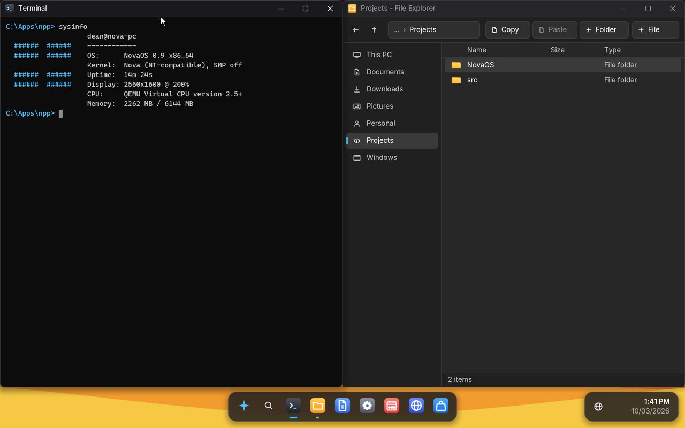

# NovaOS user guide

NovaOS is an operating system that runs Windows programs as they are,
without Windows.  This guide is for using it: getting it running,
installing it, finding your way around the desktop, and installing
programs.  To build NovaOS from source, see [building.md](building.md);
on a Mac, see [macos.md](macos.md).

> **NovaOS 0.1 is an early release.**  It is developed and tested in the
> QEMU virtual machine.  It has not yet been checked on a real PC, so run
> it in a virtual machine, and do not install it on a computer whose disk
> holds anything you need.  [compatibility.md](compatibility.md) lists
> which Windows programs run.

## Getting NovaOS

NovaOS comes as one file, `nova.iso`, which is both a live system and
its own installer.  Download the one built from the newest code from the
[latest release](https://github.com/dean-plude/os/releases/latest/download/nova.iso).

## Trying it in a virtual machine

NovaOS needs a 64-bit x86 PC with UEFI firmware.  QEMU is the virtual
machine it is tested in:

- **Linux**: `sudo apt install qemu-system-x86 ovmf` (Ubuntu and Debian).
- **Windows**: in WSL2, as on Linux.
- **Mac**: `brew install qemu`; [macos.md](macos.md) has the commands
  for Apple Silicon and Intel Macs, and for UTM.

Then, on Linux, start the ISO with an empty 1 GB disk to install onto:

```bash
truncate -s 1G disk.img
cp /usr/share/OVMF/OVMF_VARS_4M.fd /tmp/OVMF_VARS.fd
qemu-system-x86_64 -machine q35 -m 2G -smp 4 \
  -drive if=pflash,format=raw,unit=0,readonly=on,file=/usr/share/OVMF/OVMF_CODE_4M.fd \
  -drive if=pflash,format=raw,unit=1,file=/tmp/OVMF_VARS.fd \
  -drive file=disk.img,format=raw -cdrom nova.iso
```

Add `-enable-kvm -cpu host` when your Linux user may use `/dev/kvm`: it
makes NovaOS run at close to the computer's own speed instead of being
emulated.  Add `-device intel-hda -device hda-duplex` for sound and a
microphone.  QEMU's network works without any options.

Other virtual machines (VirtualBox, VMware, Hyper-V) are untested.  A
VirtualBox or VMware machine set to "Other 64-bit", with EFI on, a SATA
disk and an Intel network card, is the closest match to what NovaOS
drives.

## Installing

Started from the ISO, NovaOS runs live: everything works, but nothing you
do is kept.  **Install NovaOS** opens by itself:

1. Pick the disk to install on.  **Installing erases the whole disk.**
2. Choose the file system for drive C:: NTFS (the default; it keeps file
   permissions) or FAT32.
3. When it has finished, shut down, remove the ISO (in QEMU, start again
   without `-cdrom nova.iso`), and start from the disk.

The Terminal's `install` command does the same without the window
(`install` alone lists the disks).

## First start

The first time NovaOS starts from the disk it was installed on,
**Welcome to NovaOS** opens before the desktop and asks, page by page:

1. **Your name**, shown on the Start menu and given to programs as the
   user name.
2. **Your time zone.**  Type a city (Berlin, Tokyo, New York...) to find
   its zone, or pick one from the list with the arrow keys or the mouse;
   the page shows the time there now.  The clock, the Terminal's `date`
   and `time`, Calendar and Windows programs show local time from then on,
   with daylight saving time where the zone has it.
3. **Your keyboard layout**: US, UK, US Dvorak, German, Swiss German,
   French, Swiss French, Canadian French, Spanish, Italian, Portuguese,
   Brazilian, Swedish, Finnish, Norwegian or Danish.  Picking one switches
   to it at once; try it in the box under the list.  AltGr (the right Alt
   key) types the third character printed on a key, and accent keys (´ ^
   ¨ on a German keyboard) put their accent on the next letter.
4. **The display resolution.**  Picking one switches to it at once.

Settings changes the time zone and the keyboard layout (Time & language)
and the resolution later, `tzutil /s "NAME"` in the Terminal sets a zone by its Windows name
(`tzutil /l` lists them), and `start welcome` goes through all the pages
again.

## The desktop



- **The dock** along the bottom holds Start, search, the pinned apps and
  a button for every open window; a dot under an app means it is
  running.  The network status and the clock are at the right.
- **Start** (the Windows key, or the first dock button) lists your pinned
  and installed programs, recent apps and documents, and the power menu
  (Sleep, Restart, Shut down).  Start typing to search apps, programs,
  settings pages, folders and files; Enter opens the highlighted one.
- **Windows** move by their title bar and resize from any edge.  Drag one
  to the side of the screen, or press Windows+Left or Right, to snap it
  to half the screen; Windows+Up maximizes it.
- **Right-click** the desktop, an icon, the dock or a title bar for its
  menu.

Keyboard shortcuts:

| Keys | Does |
|---|---|
| Windows | Open or close Start |
| Windows+S | Open Start's search |
| Windows+E | Open File Explorer |
| Windows+D | Show the desktop (again to bring the windows back) |
| Windows+Left / Right | Snap the window to the left or right half |
| Windows+Up / Down | Maximize, or restore and minimize |
| Alt+Tab | Switch windows (Shift+Alt+Tab goes back) |

## The built-in apps

- **File Explorer** shows This PC (every drive with its free space) and
  the folders on the left (Documents, Downloads, Pictures, Personal,
  Projects).  Double-click a folder to open it, a picture to see it in
  Photos, a program (`.exe`) to run it, a Windows Installer package
  (`.msi`) to install it, and anything else to read it in Notepad.
  Ctrl+C, Ctrl+X and Ctrl+V copy and move files, also into and out of
  Windows programs; Delete deletes.
- **Terminal** is the command line.  `help` lists its own commands
  (`dir`, `copy`, `ping`, `curl`, `wget`, `tasklist`, `devices`,
  `install`...); any other name runs that program, so Windows
  command-line programs work as on Windows, and `cmd` starts NovaOS's own
  `cmd.exe` for batch files.  Up and Down recall earlier commands.
- **Settings** has the System, Display (resolution, scale, several
  monitors), Sound (which speakers and microphone, and their volumes),
  Personalization (wallpaper), Storage, Network, Time & language (the
  regional format for dates and numbers, the time zone and the keyboard
  layout) and About pages.
- **App Store** downloads and installs open-source Windows programs (see
  below).
- **Notepad**, **Photos** (pictures and icons), **Calendar**, and
  **NetSurf**, a small web browser.

## Installing programs

The **App Store** in the dock lists programs by category.  **Get**
downloads one to `C:\Downloads`, **Install** installs it (with 7-Zip, the
Windows Installer, or the program's own setup), and **Open** starts it;
installed programs also appear in Start.  Some programs need a runtime
first, as their notes in the App Store say: Krita needs **Mesa 3D**, and
3D programs and games need **Mesa 3D** and **DXVK** (both under
Runtimes).

Programs from anywhere else install as on Windows: download the
installer, `.msi` or `.zip`, then run the installer or unzip it (7-Zip
from the App Store does that) and run the program.  Only part of what
Windows programs use is there yet, so many programs still fail:
[compatibility.md](compatibility.md) lists the ones known to work.

## Your files

Drive C: holds your files and the programs you install.  On an installed
NovaOS it is kept on the disk; NovaOS saves every change a second after
it happens and again before it restarts or shuts down.  In the Terminal,
`vol` shows where C: is kept and `sync` saves it at once.  The ISO on its
own keeps nothing, so install NovaOS, or give QEMU a second empty disk,
which NovaOS then uses for C:.

Other NTFS disks and USB sticks appear as D:, E:, and so on, in File
Explorer and to programs.  [building.md](building.md#where-your-files-are-kept)
explains how C: is stored.

## Network and sound

Wired networking starts by itself: NovaOS gets an address from the
network's DHCP server.  Settings > Network, or `ipconfig` in the
Terminal, shows it.  Wi-Fi is not supported.

Sound plays through the newest output device; Settings > Sound picks
another and sets each device's volume, and the choices are kept across
restarts.  On a laptop whose built-in microphones sit behind Intel's
audio DSP (the ThinkPad T14 Gen 4), they are the recording device
"Microphone Array (DSP)" once the DSP's firmware is built in
([hardware.md](hardware.md#the-digital-microphones-behind-the-audio-dsp)).

## Updating NovaOS

An installed NovaOS updates itself: the App Store's **Updates** page
(or `update` in the Terminal) checks for a newer version, **Update**
downloads and checks it, and **Restart** starts it.  If the new version
does not start, the next start goes back to the one you had and the
Updates page says so.  NovaOS running from the ISO or a USB stick is not
updated; download the newer ISO instead.  [updates.md](updates.md) has
the details.

## Sleep, restart and shut down

Start's power menu sleeps (where the machine supports it), restarts and
shuts down.  NovaOS saves drive C: before it restarts or shuts down.

## When something goes wrong

- **A program fails**: check its row in
  [compatibility.md](compatibility.md).  `tasklist` and `taskkill /PID n`
  in the Terminal list and stop running programs.
- **The log**: NovaOS writes what it does to the serial port (QEMU's
  `-serial stdio` shows it in your terminal) and, started from a USB
  stick, into `EFI\NOVA\bootlog.txt` on the stick.  `dmesg` in the
  Terminal shows it too.
- **Reporting**: open an issue on
  [GitHub](https://github.com/dean-plude/os/issues) with what you did,
  what happened, and the log.

## Real PCs

NovaOS boots on UEFI PCs with Secure Boot turned off, from a USB stick
made from `nova.iso` (the README says how to write it).  Its reference
machine is the Lenovo ThinkPad T14 Gen 4 (Intel), but **no real PC has
been checked yet**: [hardware.md](hardware.md) lists which of its
devices NovaOS has drivers for and what is still missing, and
[install-and-power.md](install-and-power.md) the checks still to be done
on it.
